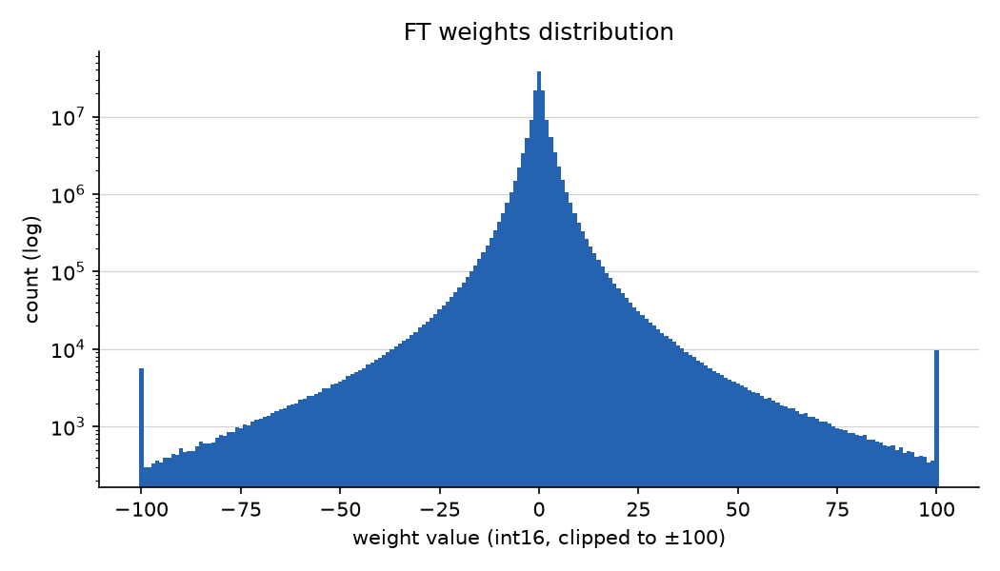
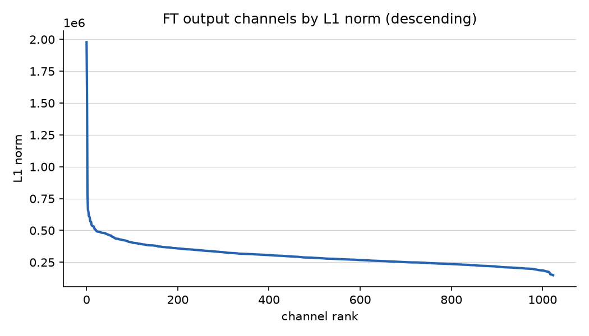
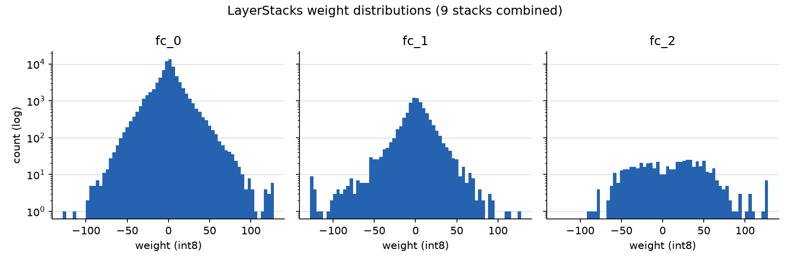

# 001-nn-analysis: Suisho 11 nn.bin の構造解析と重み分布

日付: 2026-07-11 (フェーズ1 成果物)

## 概要

`tools/nnue/` に nn.bin の parser / serializer を実装し、Suisho 11 実ファイル
(sha256 `a78b7f88…`, experiments/000-baseline の fingerprint と一致) で
**parse → serialize のバイト一致**を確認した (`tests/tools/test_roundtrip.py`)。
LEB128 圧縮部も最短長 (canonical) 再エンコードで元ファイルとビット一致する。
本レポートは同 parser による重み分布解析の結果をまとめる。

## 再現方法

```sh
uv run pytest tests/tools/                      # 往復バイト一致を含む全テスト
.venv/bin/python tools/analyze_nn.py ../suisho11/nn.bin -o experiments/001-nn-analysis
```

生成物: `stats.md` (統計表), `ft_weight_hist.png`, `ft_channel_l1.png`,
`fc_weight_hists.png`, `ft_channel_l1.npy` (チャネル別 L1 ノルム生データ)。

## ファイル構造 (確定事項)

- ヘッダ: version `0x7AF32F16` + hash `0x3C203E1C` + arch 文字列 219 バイト
  (旧名 `HalfKA(Friend)` 表記。000-baseline 既知の注意点 1 の hash 不一致は無害)
- FT 部: section hash `0x5F1348B8` + LEB128 ブロック×2
  (int16 biases 1024 個, int16 weights 131,949×1024 個, feature-major)
- LayerStacks×9: 各スタック = section hash + fc_0 (int32 bias 8 + int8 weight 8×1024)
  + fc_1 (64 + 64×32) + fc_2 (1 + 1×64)。重みはパディング入力次元込みの row-major。
  エンジン側の scrambled index はメモリ配置のみでディスク形式は線形
- fc_1 のパディング列 (入力 14〜31) は全スタックで完全にゼロ

## 重み分布の要点

数値は `stats.md` 参照。フェーズ2 の手法選定に効く観察:

1. **FT 重みは強くゼロ集中**: 28.1% が厳密に 0、|w|≤1 が 60.7%、|w|≤8 で 95.4%。
   分布は鋭いラプラス型 (`ft_weight_hist.png`)。FT の圧縮 (int8 化・スパース化) の
   余地が大きいことと整合する
2. **FT チャネル重要度 (L1) は「鋭い頭 + 平坦な尾」** (`ft_channel_l1.png`):
   少数チャネルが中央値の 4〜7 倍だが、最大/最小比は 13.3× に留まり、
   上位 512 チャネルでも L1 質量の 60.6% しか占めない。
   → **L1 選抜だけで 1024→512 に削っても情報の大半は残らない**。
   フェーズ2 候補 1 (FT 幅縮小) が蒸留前提であることを裏付けるデータ。
   なお L1 はチャネル並べ替え (候補 0) の重要度指標としてはそのまま使える
3. **後段 fc 層は密**: ゼロ割合は fc_0 5.0% / fc_1 3.7% / fc_2 0.9%
   (パディング列は分母から除外。fc_1 の 32 列中 18 列は構造的ゼロのパディングであり、
   これを含めると 57.9% に見えるが実体ではない)。
   fc 層スパース化 (候補 2) に既存スパース性の追い風はなく、優先度低のまま





## 留意点

- parser は次元をファイルから推定せず `Arch` (デフォルト = Suisho 11) で与える。
  末尾に余剰バイトがあれば例外を投げるため、次元不一致は必ず検出される
- 格納 hash はエンジン期待値と不一致でも verbatim に保持する (バイト一致優先)。
  エンジン警告を消したい場合は serializer 前に `model.hash` 等を書き換えればよいが、
  元ファイルとのバイト一致は失われる
- チャネル並べ替え・FT 縮小などの重み加工は `NNUEModel` の numpy 配列を
  直接編集 → `serialize_file` で書き出す想定 (parse 結果の配列は全て書き込み可能)
