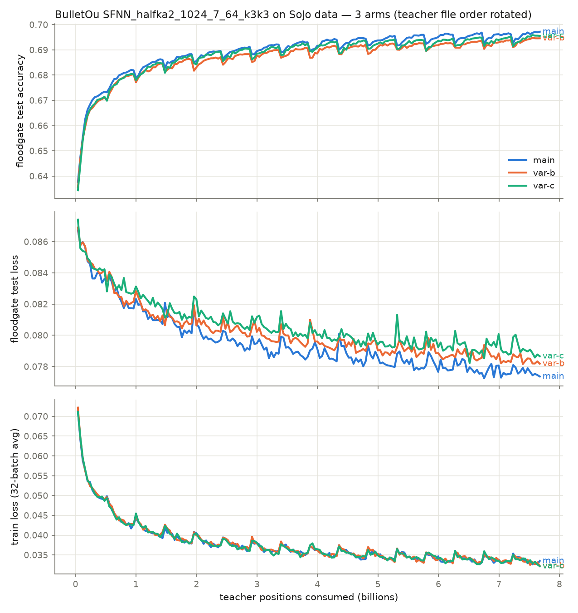
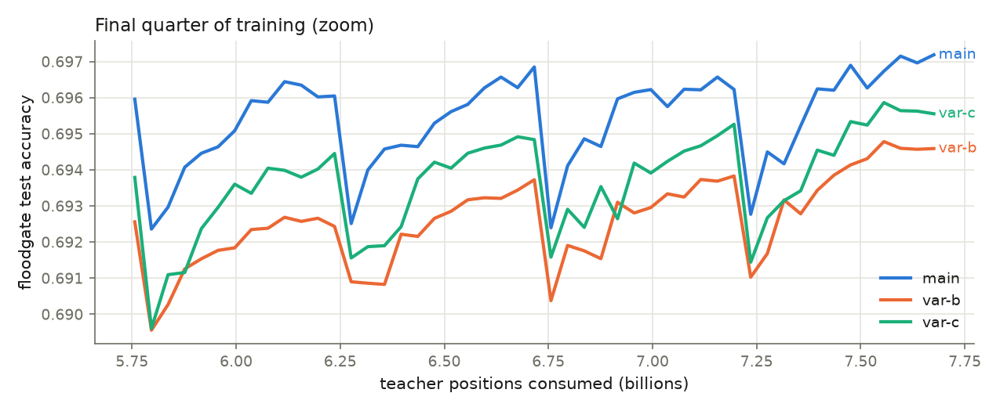

# 005-bulletou-sojo: BulletOu + 奏乗教師データで WCSC36 水匠級の評価関数が再現できるか

**判定:** **再現失敗 (共有コマンドの数値のまま、では)** — 学習は健全に収束したが、
得られたネットは Suisho 11 に対し **Elo −293 (95% CI −434 〜 −204)**、SPRT は
H0 (−30 Elo より弱い) を受理。ただし共有コマンドは `--superbatches` /
`--max-epochs` に「ここ調整」注記付きの**テンプレート**であり、そのままの値では
学習量が氏の「2 日」に全く届かない (下記解釈)。**氏の実際の 2 日分計算量での
再現可否は未検証** — 学習曲線は 16 epoch 時点でまだ改善中で、学習量を
桁で増やす追実験が次のステップ。

## TL;DR

やねうら氏共有のレシピ (BulletOu, `SFNN_halfka2_1024_7_64_k3k3`, 40M 局面 × 12 sb ×
16 epoch, Ranger, step LR) を奏乗教師データ 78 億局面で実行した。RTX PRO 5000
(Blackwell) では **1 run = 68 分** (2.32M pos/s) で完走し、floodgate.hcpe に対する
test accuracy は **69.7%** に到達。教師ファイル順を回転した 3 アームの差は
accuracy ±0.13pp と小さく、結果はデータ順にほぼ不感。しかしフェーズ3 自己対局
(vs Suisho 11, 校正済み movetime 240ms) は 32 ペア 64 局で **10/64 (15.6%)**、
Elo −293 で SPRT 棄却。「共有された数値そのままでは水匠級にならない」が結論。
テンプレートの学習量 (76.8 億局面 = 68 分) と「2 日」の乖離が主因とみられる。

## 仮説

`hypothesis.md` 参照。決定指標はフェーズ3 プロトコルの自己対局 Elo 差
(pentanomial SPRT, elo0=-30 / elo1=0)。「再現成功」= 95% CI が -30 Elo 以上と交差。

## セットアップ

- 学習: BulletOu `9577f08` (cuda-cpp, ローカルパッチで sm_120 SASS 追加 — 数値経路不変)。
  コマンドは `command.md` / `run_training.sh`
- 教師: 奏乗 001–016 (16 × 488,964,981 = 78.2 億局面, PSV)。再シャッフルなし
- 検証: [takaoyamaoka/floodgate.hcpe](https://huggingface.co/datasets/takaoyamaoka/floodgate.hcpe)
  856,923 局面から毎 sb 300k サンプル (ユーザー指定。やねうら氏の私有 fg 系テストの公開代替)
- アーム: main (ファイル順 001→016) / var-b (009 起点回転) / var-c (005 起点回転)。
  BulletOu は初期化シード固定・再シャッフルなしのため、ファイル順回転が run 間分散の代理
- ハード: RTX PRO 5000 Blackwell 48GB × 3 (1 run = 1 GPU で 3 アーム並列)
- 記録: W&B `suisho/suisho-test` (per-sb train/test loss, accuracy, LR) + ローカル JSONL

## 設定の完全な記録

### 学習設定 (全パラメータ)

明示指定はやねうら氏共有コマンドと同値。「(default)」は共有コマンドに現れず
BulletOu のデフォルトを継承した値 (氏が同版を使っていれば同値のはず)。

| パラメータ | 値 | 備考 |
| --- | --- | --- |
| BulletOu | commit `9577f08` | 氏の実行版は不明。ローカルパッチ: build.rs に sm_120 SASS 追加 (数値経路不変) |
| `--backend` | cuda-cpp | 共有コマンド同値 |
| `--arch` | `SFNN_halfka2_1024_7_64_k3k3` | 共有コマンド同値 |
| `--teacher` | 奏乗 001–016 の明示カンマ列 (arm ごとに回転順) | 氏は `C:\shogi\teacher\sojo` (ディレクトリ; 中身不明) |
| `--test-teacher` | `floodgate.hcpe` (856,923 局面) | **氏と異なる** (私有 `test20231010_fg2021_dls5_ryfc20_ev8250k825.hcpe`) |
| `--test-positions` | 300000 | 共有コマンド同値 |
| `--positions-per-superbatch` | 40000000 (実効 39,976,960) | 共有コマンド同値 |
| `--superbatches` | 12 | 共有コマンド同値 (氏の注記「ここ調整」) |
| `--max-epochs` | 16 | 共有コマンド同値 (氏の注記「ここ調整」) |
| `--lr` / `--lr-min` | 0.000875 / 0.000030 | 共有コマンド同値 |
| `--lr-schedule` | step (gamma 自動 = 1 epoch で lr-min 到達, epoch 境界で warm restart) | 共有コマンド同値 |
| `--optimizer` | ranger (beta1=0.99 default) | 共有コマンド同値 |
| `--optimizer-weight-decay` | 0.0 | 共有コマンド同値 |
| `--save-rate` / `--validation-rate` | 9999 / 1 (epoch 末 save は default 有効) | 共有コマンド同値 |
| `--tag` → `--output` | arm 別 `checkpoints/005-<arm>` | 氏は `--tag sfnn-sojo-12sb` (出力先の違いのみ) |
| batch size | 65536 (default) | |
| lambda / scale | 1.0 / 290 (default) | 教師 eval 100% (勝敗未使用) |
| score_drop_abs | 32000 (default) | ±32000 の詰みスタンプ除外 |
| SFNN factorizer | shared (default) | |
| loss | sigmoid-mse (default; nnue_pytorch_wrm_loss off) | |
| buffer / threads | 4096MB / dataloader 4 (default) | 学習結果に影響しない I/O 設定 |
| GPU | RTX PRO 5000 Blackwell 48GB ×1/run | 氏の GPU 不明。学習は固定シードで決定的のためハード非依存 |

### 強さ測定設定 (全条件)

| 項目 | 値 |
| --- | --- |
| エンジン | やねうら王 `YaneuraOu-by-gcc` sha256 `87857ca8…` (両陣営同一, 2026-07-21 ビルド) |
| 評価関数 | baseline: Suisho 11 `nn.bin` sha256 `a78b7f88…` / candidate: main 最終 `nn.bin` sha256 `57f59777…` |
| 持ち時間 | `go movetime 240` (ms) 固定。校正実測 median 1,974,173 nodes/move (PLAN 目標 ~2M) |
| エンジン設定 | Threads 16, USI_Hash 1024MB, USI_Ponder false, MultiPV 1, NetworkDelay=NetworkDelay2=0, BookFile no_book, MaxMovesToDraw 0 (手数上限はハーネス側 320 plies で引き分け判定) |
| 開始局面 | やねうら王互角局面集2025 (24手目, 30,053 局面) を `NR%60==1` 等間隔ストライド抽出した 500 局面 (`start_sfens_500.txt`) |
| 対局形式 | 1 ペア = 同一開始局面の先後入替 2 局、直列 1 局ずつ |
| 終局判定 | 詰み (合法手なし) / resign / 入玉宣言 (`bestmove win`) / 同一局面 4 回 (千日手 — 連続王手は cshogi 分類で勝敗) / 320 手で引き分け |
| 統計 | pentanomial GSPRT (elo0=−30, elo1=0, α=β=0.05, 最小 32 ペア, 上限 500 ペア) |

### 原設定 (やねうら氏) との差分まとめ

| 項目 | 既知/不明 | 差分と影響 |
| --- | --- | --- |
| テスト教師 | **既知の差** | 氏の私有 fg2021 系 hcpe は入手不能 → 公開 floodgate.hcpe (2017-2018) で代替。accuracy/loss の絶対値は氏の値と比較不能。early stop 判定にも影響しうるが、本実験では early stop 自体が発火しなかったため**学習結果 (重み) には影響なし** |
| 教師の集合・順序 | 不明 | 氏の sojo フォルダの中身・並びは不明。本実験は 001–016。3 アームのファイル順回転で感度を測り、差は誤差レベルと確認済み |
| `--superbatches` / `--max-epochs` | **不明 (最重要)** | 共有値 12/16 は「ここ調整」注記付きテンプレート。この値の学習量 (76.8 億局面) は本環境で 68 分、氏の環境でも数時間相当で、「2 日くらい学習」と桁が合わない。**氏の実走はより大きかった可能性が高く、本実験の否定的結果はテンプレート値に対するもの** |
| BulletOu の版 | 不明 | 本実験 `9577f08` (2026-07-27 clone)。学習挙動が版によって変わる可能性は残る |
| 強さの測定方法 | 不明 | 「WCSC36 の水匠と同じくらい」の測定条件 (持ち時間・対局数・相手) は不明。本実験はフェーズ3 プロトコル (movetime 240ms ≒ 2M nodes/move) で測定 |
| GPU / wall-clock | 不明 | 学習は固定シード・再シャッフルなしで決定的のため、同一スケジュールならハード差は結果に影響しない (wall-clock のみ変わる) |

## 結果 (学習フェーズ)

| Arm | floodgate acc (final) | floodgate loss (final) | train loss (final) | 16 epoch 完走 |
| --- | --- | --- | --- | --- |
| main  | **69.72%** | 0.07736 | 0.03348 | ✅ (early stop なし) |
| var-b | 69.46% | 0.07818 | 0.03221 | ✅ |
| var-c | 69.56% | 0.07866 | 0.03217 | ✅ |

- 学習は安定 (NaN・発散なし)。毎 epoch の LR warm restart (step schedule) による
  のこぎり状の一時悪化を挟みつつ、test loss/accuracy は 16 epoch 通して改善が持続
  → `--max-epochs 16` は「まだ伸びる」側で打ち切られており、レシピの
  「ここ調整」ポイント (`--superbatches` / `--max-epochs`) には増やす余地がある
- アーム間差 (データ順感度): accuracy 差 max 0.26pp、test loss 差 max 0.0013。
  単一 run の結論としても実質的に頑健
- スループット 2.32M pos/s/GPU。1 run 68 分 (train 3306s + 検証/保存等)

## 結果 (強さ測定 — フェーズ3)

| 項目 | 値 |
| --- | --- |
| 対局数 | 32 ペア / 64 局 (SPRT が受理し打ち切り) |
| 得点 (main 側) | **10 / 64 (15.6%)** — 先手 5/32, 後手 5/32 |
| pentanomial (ペア得点 0/0.5/1/1.5/2) | [22, 0, 10, 0, 0] |
| Elo 差 (vs Suisho 11) | **−293** (95% CI **−434 〜 −204**) |
| SPRT (elo0=−30, elo1=0, α=β=0.05) | LLR −8.27 ≤ −2.94 → **H0 受理 (−30 Elo より弱い)** |
| 終局理由 | 詰み 63, 入玉宣言勝ち 1 (千日手なし) |
| 平均手数 | 121.0 手 (開始局面 24 手目から) |

条件は「設定の完全な記録」参照。生データ:
`games/main-vs-suisho11-r2/games.jsonl` (git 管理外)。

補足: 初回測定 (`games/main-vs-suisho11/`) はレビューで判明した
**千日手判定バグ (同一局面 2 回目で成立扱い + 優等/劣等局面の誤終局)** の影響下で
14/64 (Elo −221) だった。ルール修正後の再測定が上記 r2 で、正しいルールでは
むしろ差が広がった (誤判定は弱い側に有利に働いていた)。判定はどちらでも同じ H0 受理。

r1 測定中にエンジンプロセスの散発的な silent crash が 2 回発生 (stderr 出力なし、
両陣営同一バイナリ)。respawn+リトライで回復し、r2 では発生しなかった。

## 解釈

1. **共有コマンドの数値そのままでは「WCSC36 水匠と同等」は再現しない。**
   −293 Elo は明確な差で、判定基準 (CI が −30 と交差) を大きく外れる
2. **主因は学習量の乖離とみられる。** 共有コマンドは `--superbatches 12` /
   `--max-epochs 16` に「ここ調整」注記が付いた**テンプレート**であり、この値では
   76.8 億局面 = 本環境で 68 分・氏の環境でも数時間で終わる。「2 日くらい学習」
   という記述と桁で合わない。氏の実走は学習量が 1〜2 桁大きかった可能性が高い
   (教師ストリームは EOF で wrap するため epoch を増やすだけで学習量は稼げる)。
   **2026-07-28 追記**: たややん氏も「この設定だと 76 億局面しか学習していない気が
   する。教師局面数が 150 億局面くらいありそう」と同じ見立てに到達 (氏がやねうら氏に
   実設定を確認予定)。「epoch = 教師 1 周」解釈なら 16 epoch ≒ 2350 億局面で
   「2 日」とも整合する — 詳細は「次のステップ」参照
3. その読みと整合して、**floodgate accuracy は 16 epoch 時点でまだ単調改善中**
   (69.7%、頭打ちの兆候なし)。学習の器 (アーキテクチャ・データ・トレーナ) は健全で、
   スケジュールだけが足りていないという形
4. 学習自体は極めて安定・決定的で、データ順の影響も誤差レベル (3 アーム差 0.26pp)。
   「BulletOu + 奏乗データ」というパイプラインの有効性自体はこの実験で確立できた

## 次のステップ (experiment-006 計画 — 2026-07-28 更新)

**時間 (「2 日」) でも BulletOu の「epoch」でも刻まない。学習量は
「総学習局面数 / 教師全体 (30 ファイル ≒ 146.7 億局面) の周回数」で刻む。**

理由 — 用語「epoch」の罠 (たややん氏の指摘 2026-07-28 で確度が上がった):
`--superbatches 12` 明示時の BulletOu の 1 epoch は 12×40M = 4.8 億局面の
LR サイクルであり、**教師データ 1 周ではない**。本実験の 16 epoch = 76.8 億局面は
教師全体の約半周にすぎない。たややん氏も「この設定だと 76 億局面しか学習して
いない気がする。教師局面数が 150 億局面くらいありそう」と同じ計算に到達している。
もしやねうら氏の実走で 1 epoch ≒ 教師 1 周 (`--superbatches` ≒ 367、または未指定で
EOF 区切り) だったなら、16 epoch = **約 2350 億局面 ≒ 本環境 GPU で 28 時間**となり
「2 日くらい」と整合する。この場合 **LR スケジュールの周期も epoch 長に伸びる**
(step 減衰が 1 epoch で lr-min に到達する設計) ため、単なる学習量差ではなく
スケジュール自体が別物になる点に注意。氏の実設定はたややん氏がやねうら氏に
確認予定 → 判明したらその設定を最優先で再現する。

計画 (氏の設定判明前でも進められる形):

1. **フェーズ a (GPU 不要・即開始可)**: exp-005 保存済み checkpoint
   (`005-main/0001..0016/` = 4.8〜76.8 億局面, log 間隔で 1/2/4/8/16 番を使用) で
   vs Suisho 11 の Elo を測定し、カーブの序盤を埋める。カーブ用測定は SPRT ではなく
   **固定 50 ペア (100 局)** で Elo ± 95% CI を点推定 (SPRT は yes/no で止まり
   点比較に不向き。各点 ~1 時間)
2. **教師の残り 14 ファイル (~274 GB) をダウンロード**し、教師全体 146.7 億局面を揃える
3. **フェーズ b (長期学習)**: supervisor (`train_supervised.py`) で長期 run を起動し、
   総学習局面数が教師全体の **1, 2, 4, 8, 16 周** (147 億〜2350 億局面 ≒ GPU 1.8h〜28h)
   に達した時点の checkpoint を随時フェーズ a と同条件で測定。スケジュール構成は
   氏の設定が判明すればそれに合わせ、不明のままなら「1 epoch = 教師 1 周」設定
   (`--superbatches 367`) を第一候補とする (LR 周期が「2 日」解釈と整合するため)
4. **最終判定のみ SPRT**: カーブが 0 Elo 付近に到達 (または頭打ち) した checkpoint
   に対してだけ、005 と同じ SPRT (elo0=−30, elo1=0) で「水匠級か」を判定
5. 周回学習 (>1 周) の効果はカーブの屈曲として直接観察できる

## 妥当性への脅威

- **Suisho 11 の floodgate accuracy 参照値が未取得** (本エンジンビルドに静的 eval
  コマンドがなく、BulletOu の eval 例は旧 checkpoint 形式専用)。69.7% が
  「水匠級」からどれだけ離れているかの直接比較はできていない — 強さ判定は
  対局 Elo のみに依拠
- **テストセットが本人と異なる** (floodgate 2017-2018 vs 氏の非公開 fg2021 系):
  loss/accuracy の絶対値は氏の値と比較できない。early stop 挙動もズレうる
  (今回は 16 epoch 完走なので early stop 差は顕在化せず)
- **教師の消費範囲・順序が不明** (本実験は 001–016 固定 + 回転 2 アーム)
- **BulletOu の版差**: 氏の実行コミット不明。本実験 `9577f08`
- SPRT 実装は自作 (GSPRT 近似 + 分散下限 + 最小 32 ペア)。開発中に 3 つのバグ
  (1 ペア即断・千日手 2 回判定・優等局面誤終局) をレビューで検出し修正、
  最終数値は全て修正後ルールの r2 再測定によるもの。数式は fishtest 方式と
  照合済み (2 系統のレビューで独立検算)

## 再現

- リポジトリ commit: `7d25aaa` + 本実験フォルダ (experiments/005-bulletou-sojo/)
- データ取得: `data/teacher/sojo/download.sh` / floodgate.hcpe は HF から直接
- 学習: `bash experiments/005-bulletou-sojo/run_training.sh main 0` (GPU 必須。
  Claude Code sandbox は GPU 不可視のため sandbox off か実端末で — issue #13 参照)
- 対局: `data/matchenv/bin/python experiments/005-bulletou-sojo/match_runner.py
  --candidate-evaldir data/bulletou/eval/main --name main-vs-suisho11`
  (cshogi は numpy<2 制約のため専用 venv `data/matchenv/`)
