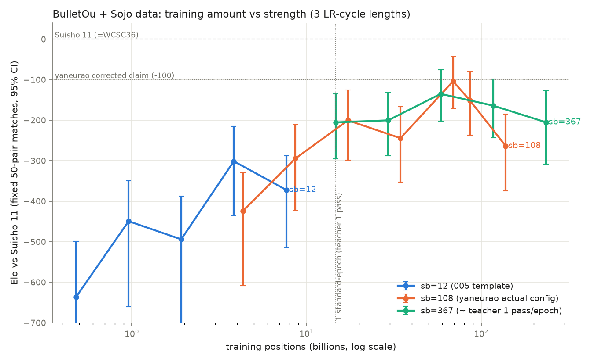

# 006-standard-epoch: 学習量と LR 周期 (superbatches) を伸ばせば奏乗レシピはどこまで強くなるか

**判定:**
1. **やねうらお氏の訂正後の主張は再現された** — 氏の実設定 (sb=108 × 16 BulletOu-epoch)
   の net は Suisho 11 (= WCSC36 水匠、氏の比較対象と同一とたややん氏確認) に対し
   **Elo −104 (95% CI −171 〜 −43)**。氏の「強さは R100 ぐらい低い」とほぼ一致
2. **「sb を上げればもっと強くなる」は今回の範囲では確認できず** — sb=367 のベスト
   (−135 @ 4 周) は sb=108 のベスト (−104 @ 4.7 周) を上回らなかった (CI は重なる)
3. **新知見: 強さは教師データ 4〜5 周でピークに達し、以降は明確に低下する** —
   sb=108 で 32 epoch (9.4 周) まで延長すると −263 まで悪化 (ピークと CI 非重複)。
   一方 floodgate accuracy は低下しない (70.4% で頭打ちのまま) — **accuracy と強さの
   乖離**が学習量の軸でも観測された

## TL;DR

experiment-005 の「テンプレート値 (sb=12) では −293」を受け、やねうらお氏本人が
実設定 (sb=108 × 16ep) と主張の訂正 (「R100 低い」) を公開した。本実験は
sb ∈ {12, 108, 367} の 3 系列で「総学習局面数 → Elo」カーブを実測し、
(a) 氏の設定で −104 を再現、(b) 強さのピークは教師 4〜5 周付近にあり
それ以降の周回学習は逆効果、(c) sb をさらに上げても (今回の範囲では) ピークは
上がらない、を示した。奏乗データ + このレシピの現状の到達点は
**水匠11 比 −100 Elo 前後**である。

## 用語

experiment-005 で定義: **BulletOu-epoch** = `--superbatches N` × 40M 局面の
LR サイクル (データ量と無関係)。**standard-epoch (周)** = 教師全体 1 周
(奏乗全 30 ファイル = 14,668,949,437 局面)。

## 測定結果 (全 17 点, 各 50 ペア = 100 局, vs Suisho 11)

### sb=12 系列 (005 テンプレート。checkpoint は experiment-005 main run)

| BulletOu-ep | 局面数 | Elo | 95% CI |
| --- | --- | --- | --- |
| 1 | 4.8 億 | −636 | −3600 〜 −499 |
| 2 | 9.6 億 | −449 | −660 〜 −349 |
| 4 | 19.2 億 | −494 | −755 〜 −387 |
| 8 | 38.4 億 | −301 | −436 〜 −215 |
| 16 | 76.8 億 | −372 | −514 〜 −287 |

### sb=108 系列 (やねうらお氏実設定 + 延長)

| BulletOu-ep | 局面数 (周) | Elo | 95% CI |
| --- | --- | --- | --- |
| 1 | 43 億 (0.3) | −424 | −609 〜 −329 |
| 2 | 86 億 (0.6) | −295 | −423 〜 −210 |
| 4 | 173 億 (1.2) | −200 | −298 〜 −125 |
| 8 | 346 億 (2.4) | −244 | −353 〜 −166 (47 ペア) |
| **16** | **691 億 (4.7)** | **−104** | **−171 〜 −43** ← 氏の実設定 |
| 20 | 864 億 (5.9) | −151 | −237 〜 −80 |
| 32 | 1382 億 (9.4) | −263 | −374 〜 −185 ← 過学習で悪化 |

### sb=367 系列 (LR 周期 ≒ 教師 1 周)

| BulletOu-ep | 局面数 (周) | Elo | 95% CI |
| --- | --- | --- | --- |
| 1 | 147 億 (1) | −205 | −296 〜 −135 (49 ペア) |
| 2 | 293 億 (2) | −200 | −288 〜 −131 |
| 4 | 587 億 (4) | −135 | −203 〜 −75 |
| 8 | 1174 億 (8) | −164 | −244 〜 −98 |
| 16 | 2347 億 (16) | −205 | −309 〜 −127 |

### 学習指標 (floodgate.hcpe accuracy, 参考)

| net | accuracy | 備考 |
| --- | --- | --- |
| 005 sb=12 ep16 | 69.72% | Elo −293〜−372 |
| yane sb=108 ep16 | 70.39% (実測 run 内) | Elo −104 |
| yane sb=108 ep32 | 70.39% | Elo −263 — **accuracy 同一で Elo 大幅悪化** |
| std sb=367 ep16 | 70.25% | Elo −205 |

## 解釈

1. **氏の訂正後の主張はそのまま再現された** (−104 vs 「R100 低い」)。005 の結果と
   合わせ、事実関係は完全に整合: テンプレート値では −293 / 実設定では −104 /
   「水匠と同等」は本人も撤回済み
2. **LR 周期 (sb) の役割は「小さすぎると悪い」まで**: sb=12 → 108 は劇的に効いた
   (+190 Elo @ 匹敵する局面数) が、108 → 367 の追加効果は観測できなかった。
   氏の「sb 上げればもっと強くなるはず」は、少なくとも 367 までの範囲・この教師では
   支持されない (ただし各点 ±70 Elo 級の CI であり、±30 Elo 級の差は検出できない)
3. **強さのピークは教師 4〜5 周**: sb=108 は 4.7 周 (−104)、sb=367 は 4 周 (−135) で
   ピークし、以降は単調悪化。sb=108 の 9.4 周では −263 と、ピーク比 −159 Elo の
   明確な悪化 (CI 非重複)。**このレシピの限界は LR スケジュールではなくデータ再利用**
   が決めている可能性が高い
4. **accuracy は過学習を検出できない**: ep16 → ep32 で floodgate accuracy は 70.39% の
   まま不変なのに Elo は −104 → −263。教師分布への適合が進む一方で探索と組み合わさった
   ときの実戦強さが壊れる、という乖離であり、モデル選択を accuracy でやってはいけない
   (氏の当初の誤認もこの乖離が原因とみられる)
5. 到達点: 奏乗データ + BulletOu + `SFNN_halfka2_1024_7_64_k3k3` の現状ベストは
   **水匠11 比 −100 Elo 前後**。ここから先は (a) 教師データの拡充 (奏乗は unique
   局面 147 億で頭打ち)、(b) レシピ側の工夫 (LR/正則化/ep4〜5 周辺での早期停止)、
   (c) アーキテクチャ変更、のいずれかが必要

## 実験手順 (要点)

- 学習: BulletOu `9577f08` (+sm_120 patch)、教師 = 奏乗全 30 ファイル (HF manifest と
  全ファイル byte 一致検証済み)、検証 = floodgate.hcpe。arm yane20 (sb=108×20ep,
  GPU 8.6h) → yane32 (checkpoint 0020 から resume、累積 32ep。resume 時の
  `--max-epochs` は累積上限として解釈される点に注意)、arm std (sb=367×16ep, GPU 28h)。
  supervisor 方式で W&B project `20260728_BulletOu_with_Sojo_data` に記録
- sb=108 の 16ep checkpoint は決定的学習により yane20 run の 0016 と同一 (別 run 不要)
- 測定: experiment-005 フェーズ3 と同一条件 (movetime 240ms ≒ 2M nodes/move 校正済み・
  16 threads・hash 1024・互角局面集ストライド 500・同一エンジンバイナリ 87857ca8)。
  カーブ用は SPRT なしの固定 50 ペア。総対局数 1700 局
- 生データ: `games/<name>/games.jsonl` (git 管理外)、図: `plot_elo_curves.py`

## 妥当性への脅威

- **エンジンの散発的 silent crash** が本測定期間で増加 (respawn 13 回+、両陣営同一
  バイナリ・stderr/カーネルログに痕跡なし)。リトライで全て回復したが、4 点で
  1〜3 ペア欠落 (n=47〜49)。クラッシュが局面・ネット非依存に見えることから
  系統誤差は小さいと判断
- 各点 50 ペアの CI は ±70〜100 Elo 程度。±30 Elo 級の差 (例: sb=108 vs 367 の
  ピーク差) は解像できない。ピーク位置 (4〜5 周) と ep32 の悪化は CI 非重複で頑健
- 「ピークは 4〜5 周」は 2^n 格子での観測であり、真のピークは ep8〜20 (sb=108) の
  間のどこかにある可能性がある
- 氏の run との残差分 (教師ファイル構成・test set・BulletOu 版) は不明のまま。
  それでも −104 ≈ −100 の一致は偶然にしては良すぎる程度に近い

## 次の候補

- ピーク近傍 (sb=108, ep12〜24) の細かい Elo 測定 + ペア数増で最良 checkpoint を確定し、
  それを exp-007 以降のベース評価関数候補にする
- フェーズ2 本線 (docs/PLAN.md) への接続: この学習パイプラインで FT 幅縮小蒸留
  (着手順 2) に必要な「教師データ + トレーナ」の前提が整った
- エンジン silent crash の根本調査 (再現条件の切り分け)

## 再現

`hypothesis.md` / `metadata.json` / `run_training.sh` / `measure_curve.sh` /
`train_supervised.py` / `sync_combined.py` 参照。W&B:
[training runs](https://wandb.ai/suisho/20260728_BulletOu_with_Sojo_data)。
