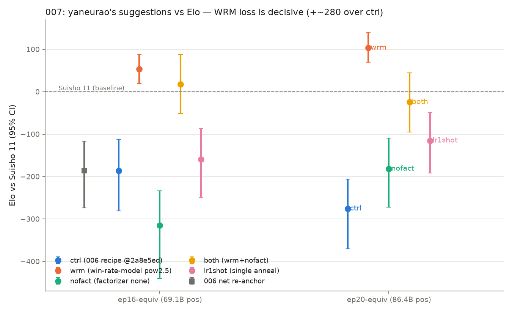

# 007-wrm-factorizer: やねうらお氏の 3 提案の Elo 検証 — WRM loss が決定打 (水匠11 超え)

**判定:**
1. **WRM loss (`--win-rate-model --loss-pow-exp 2.5`) は決定的に有効** — 同一予算の
   ctrl 比 **≈ +280 Elo**。最良 checkpoint (wrm ep20) は **vs Suisho 11 で +104
   (95% CI +69〜+140, 200 ペア)**、つまり本レシピは初めて**水匠11 を明確に上回った**。
   006 基準 net との直接対局 SPRT (elo0=0, elo1=+50) は **32 ペアで H1 受理**
   (+283, CI +194〜+421)
2. **単発アニール (lr1shot, ユーザー提案) は中程度に有効** — 総予算一致の比較で
   ep20 相当 −115 (CI −191〜−49) vs ctrl-ep20 −275 (CI −371〜−206, **CI 非重複**)。
   warm restart 廃止は ctrl に見られる後期の悪化を防ぐ。ctrl 側最良点 (−186) との差は
   +71 で CI 重複 (50 ペア解像度では「悪化防止は確実、ピーク向上は示唆どまり」)
3. **factorizer 無効化 (`--sfnn-factorizer none`) は無効〜やや有害** — Elo で
   ctrl と区別できず (pooled でむしろ下)、accuracy は −0.25pp 低下。wrm への追加
   (`both`) も wrm 単独を上回らない (2 点とも下回る)。**氏の「外すと最終 accuracy が
   高くなる」は本設定では accuracy でも Elo でも再現しなかった**
4. **副産物 (proxy 問題)**: wrm の +280 Elo を floodgate accuracy はわずか
   **+0.15pp** しか検出しなかった。006 の範囲制限の外側 (レシピ間比較・実効差
   200 Elo 級) でも accuracy はほぼ無力 — モデル選択は対局必須、の結論を強化

## TL;DR

やねうらお氏の 3 提案 + ユーザー提案 (LR 単発アニール) を、BulletOu `2a8e5ed` 上の
5 arm 統制比較 (全 arm 総局面 864 億で統一) で Elo 検証した。tatara 式 WRM loss
一つで奏乗レシピの到達点は「水匠11 より 100 低い」から「**水匠11 より 100 高い**」へ
一段跳んだ。LR 単発アニールも独立に有効 (特に過学習抑制)。factorizer 無効化は効かず。
次の本命は **wrm × lr1shot の併用** (フェーズ3)。

## 測定結果 (vs Suisho 11, 95% CI)

| arm | ep16 相当 (69.1B) | ep20 相当 (86.4B) |
| --- | --- | --- |
| 006 net (re-anchor, 旧コミット) | −186 [−274, −116] n=50 | — |
| ctrl (006 レシピ @2a8e5ed) | −186 [−281, −112] n=50 | −275 [−371, −206] n=50 |
| **wrm** | **+53 [+19, +89] n=200** | **+104 [+69, +140] n=200** |
| nofact | −315 [−441, −234] n=50 | −182 [−273, −109] n=50 |
| both (wrm+nofact) | +17 [−51, +87] n=50 | −24 [−95, +45] n=50 |
| lr1shot (単発アニール) | −160 [−248, −87] n=50 | −115 [−191, −49] n=50 |

- ctrl-ep16 の**再測定** (妥当性検証, 別 50 ペア): −263 [−355, −195] → 原測定と
  CI 重複、pooled ≈ −220。「初期測定が CPU 負荷で汚染された」仮説は棄却
  (再測定はむしろ低く出た。nodes/move 実測 2.1〜2.4M で両陣営対称も確認)
- **直接対局**: wrm-ep20 vs 006-yane-ep16 = +283 [+194, +421]、SPRT H1 受理 (32 ペア)

### 学習指標 (floodgate accuracy, 参考)

| arm | ep16 | ep20 | Elo との対応 |
| --- | --- | --- | --- |
| ctrl | 70.17% | 70.20% | 基準 |
| wrm | 70.32% | 70.35% | **+0.15pp で +280 Elo** |
| nofact | 70.03% | 69.95% | −0.25pp で Elo ほぼ不変 |
| both | 70.00% | 70.14% | — |
| lr1shot | 70.27% | 70.28% | +0.1pp で +100〜160 Elo (ep20) |

accuracy の序列は Elo の序列と方向は概ね一致するが、**効果量を 3 桁近く圧縮する**。
レシピ選択を accuracy で行うのは (方向すら) 危険 — nofact は accuracy では
「わずかに悪い」だが、氏の環境では「最終的に高い」と報告されており、環境依存の
±0.2pp 級のゆらぎに意味はない。

## 解釈

1. **WRM loss の +280 は「教師の使い方」の改善**: 同一データ・同一 arch・同一
   予算・同一 LR で loss 関数だけを変えた統制比較なので、帰属は明確。tatara /
   nnue-pytorch 系で実績のある勝率空間の損失が、sigmoid-MSE (cp 空間) より
   探索と噛み合う net を作る
2. **lr1shot は「過学習の力学」を変える**: ctrl は ep16→ep20 で −89 悪化するのに
   lr1shot は +45 改善 (単発アニールの終端に向かって単調改善)。006 の「4〜5 周
   ピーク後に悪化」は warm restart 依存の現象である可能性が高い
3. **wrm も ep16→ep20 で改善** (+53→+104): WRM loss 下では周回学習の悪化が
   (この範囲では) 見えない。ピーク位置がどこまで延びるかは未測定
4. **加法性は成立せず**: wrm(+280) + nofact(≈0〜−50) の併用は wrm 単独を下回る
   (2 点とも)。nofact は採用しない
5. コミット更新 (9577f08→2a8e5ed) は Elo 中立 (ctrl ≡ re-anchor)。エンジン再ビルド
   (87857ca8→4881fcf4, nodes/move +22%) は絶対値を約 −80 シフト (旧 −104 net が
   新条件で −186)。**本実験内の比較はすべて新条件で閉じており影響なし**

## 実験手順 (要点)

- 学習: BulletOu `2a8e5ed` (+ sm_120 patch, `--features cuda-cpp-backend`,
  要 CUDA_PATH + nvcc on PATH)。教師 = 奏乗 30 ファイル、検証 = floodgate.hcpe、
  arch `SFNN_halfka2_1024_7_64_k3k3`。全 5 arm 同一総局面数 (2160 sb = 864 億)。
  GPU 3 枚並列 (2→3 枚は実測 +30% スループットで採用)、各 arm 実測 ~12.3h
- 測定: 005/006 と同一プロトコル (movetime 240ms・16 threads・hash 1024・
  互角局面集 500・先後入替ペア)。スクリーニング 50 ペア → wrm 2 点を 200 ペアに
  拡張 → 直接 SPRT。**エンジンは 4881fcf4** (006 とは別ビルド。006 基準 net の
  再アンカー測定で橋渡し)
- W&B: project `20260728_BulletOu_with_Sojo_data`, group `007-wrm-factorizer`
  (規約: 1 project = 実験系列 / 1 group = 1 実験。006 run にも group を遡及設定)

## 妥当性への脅威

- **エンジン silent crash の激化** (issue #18 で追跡): 対局ペアの ~8% で SIGSEGV
  (計測 20+ 件全て exit −11・bestmove 出力直後・base 側偏重 14:5)。対局は
  ペア単位で全破棄→再試行/補充のため**採点への混入はゼロ**、先後は全点で厳密
  50:50 (900/900)、skip は 13/913 ペア (1.4%, 補充済み)。ただしクラッシュ多発
  開始局面が標本から抜ける軽微な選択効果は残る
- 50 ペア点の CI は ±70〜100。nofact/lr1shot の ±50 Elo 級の差はこの解像度では
  確定しない (wrm の効果はこの 5 倍あるので影響なし)
- 旧エンジンが消失しているため 006 の絶対値との比較は再アンカー点経由の
  1 ホップ推定 (−80 シフト) に依存する
- wrm の ep>20 の挙動 (ピーク位置) は未測定 — フェーズ3 で確認予定

## 次の候補 (フェーズ3)

1. **本命: wrm × lr1shot 併用** (sb=2160 単発アニール + WRM loss, ~12h)。
   両 lever は機構が独立 (loss / スケジュール) で、lr1shot の過学習抑制が
   wrm の「まだ伸びている」カーブをさらに延ばす期待
2. wrm の学習量延長 (ep24/28 相当) — ピーク位置の確認
3. 氏の sb ラダー (324) を WRM loss 下で再検証
4. エンジン crash の根本調査 (issue #18: spawn 順スワップ・core dump 採取・
   Threads 感度) と箱の再起動

## 再現

`hypothesis.md` / `metadata.json` / `run_training.sh` / `train_supervised.py` /
`measure_screening.sh` / `queue_precision.sh` / `plot_results.py` 参照。
生対局データ: `games/*/games.jsonl` (git 管理外)。
W&B: [training runs](https://wandb.ai/suisho/20260728_BulletOu_with_Sojo_data)。
