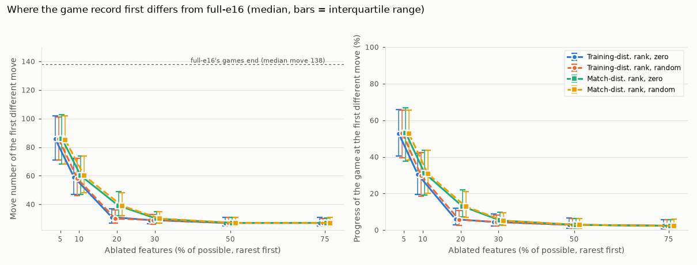
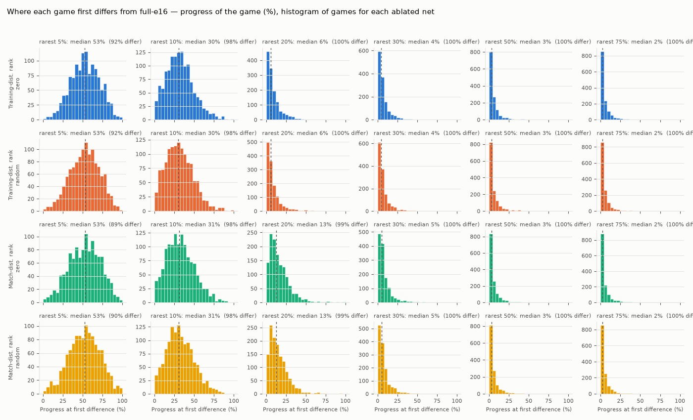
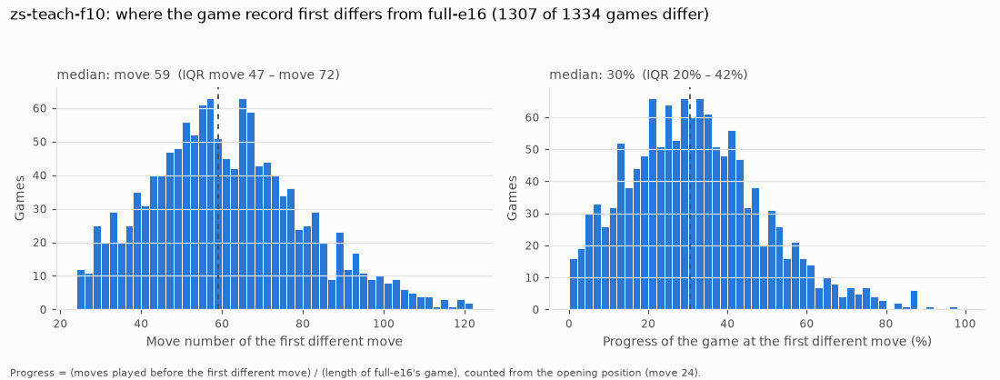

# 棋譜はどこで分かれるか (自動生成)

`games_divergence.py` が作る (手で編集しない)。最終アブレーション (full-e16 @ FV_SCALE 48 の 24 ネット, 各 667 ペア = 1,334 局, 水匠 11 相手, 300k ノード) の各局を、同じ開始局面・同じ先後の full-e16 の局と指し手列で比べ、最初に違う手の位置を数えた。

- **手目**: 開始局面 (24 手目) からの通しの手数。**進行度**: 分岐までに指した手数 ÷ full-e16 の局の手数 (どちらも開始局面から数える。full-e16 の局は中央値 115 手 = 138 手目で終局)
- 対局は決定的なので、**最初に違う手は 24 ネット・全局でアブレーションした側の手**だった
- **得点が変わったペア** ([results.md](results.md) と同じ定義): ペアの得点 (先後 2 局の合計) が full-e16 と違うペアの数。棋譜が変わっても得点は変わらないことが多い

| 順位 | モード | 下位 % | 棋譜が変わった局 | 分岐の手目 (中央値 [四分位]) | 進行度 (中央値 [四分位]) | 得点が変わったペア |
| --- | --- | --- | --- | --- | --- | --- |
| 教師 | zero | 5 | 1221 / 1334 (92%) | 86 [71, 102] | 53% [41, 66] | 183 / 667 |
| 教師 | zero | 10 | 1307 / 1334 (98%) | 59 [47, 72] | 30% [20, 42] | 332 / 667 |
| 教師 | zero | 20 | 1331 / 1334 (100%) | 31 [27, 37] | 6% [3, 12] | 427 / 667 |
| 教師 | zero | 30 | 1333 / 1334 (100%) | 29 [26, 33] | 4% [2, 9] | 404 / 667 |
| 教師 | zero | 50 | 1332 / 1334 (100%) | 27 [25, 31] | 3% [1, 6] | 417 / 667 |
| 教師 | zero | 75 | 1334 / 1334 (100%) | 27 [25, 31] | 2% [1, 6] | 412 / 667 |
| 教師 | random | 5 | 1227 / 1334 (92%) | 86 [71, 101] | 53% [39, 66] | 178 / 667 |
| 教師 | random | 10 | 1311 / 1334 (98%) | 58 [46, 72] | 30% [18, 42] | 335 / 667 |
| 教師 | random | 20 | 1332 / 1334 (100%) | 30 [27, 36] | 6% [3, 11] | 400 / 667 |
| 教師 | random | 30 | 1332 / 1334 (100%) | 29 [26, 33] | 4% [2, 8] | 414 / 667 |
| 教師 | random | 50 | 1334 / 1334 (100%) | 27 [25, 31] | 3% [1, 6] | 404 / 667 |
| 教師 | random | 75 | 1334 / 1334 (100%) | 27 [25, 30] | 2% [1, 6] | 407 / 667 |
| 対局 | zero | 5 | 1188 / 1334 (89%) | 86 [68, 103] | 53% [38, 67] | 163 / 667 |
| 対局 | zero | 10 | 1309 / 1334 (98%) | 60 [47, 74] | 31% [19, 44] | 336 / 667 |
| 対局 | zero | 20 | 1327 / 1334 (99%) | 39 [32, 49] | 13% [7, 22] | 386 / 667 |
| 対局 | zero | 30 | 1333 / 1334 (100%) | 30 [27, 35] | 5% [3, 10] | 391 / 667 |
| 対局 | zero | 50 | 1333 / 1334 (100%) | 27 [25, 31] | 3% [1, 6] | 403 / 667 |
| 対局 | zero | 75 | 1333 / 1334 (100%) | 27 [25, 30] | 2% [1, 6] | 407 / 667 |
| 対局 | random | 5 | 1196 / 1334 (90%) | 85 [68, 102] | 53% [38, 66] | 187 / 667 |
| 対局 | random | 10 | 1309 / 1334 (98%) | 60 [48, 74] | 31% [20, 43] | 323 / 667 |
| 対局 | random | 20 | 1326 / 1334 (99%) | 39 [32, 48] | 13% [7, 21] | 425 / 667 |
| 対局 | random | 30 | 1333 / 1334 (100%) | 30 [27, 35] | 5% [3, 9] | 408 / 667 |
| 対局 | random | 50 | 1333 / 1334 (100%) | 27 [25, 31] | 3% [1, 6] | 413 / 667 |
| 対局 | random | 75 | 1333 / 1334 (100%) | 27 [25, 31] | 2% [1, 6] | 403 / 667 |

24 ネットそれぞれの分布 (進行度):

1 ネットの詳細 (教師順位・zero・下位 10%):

