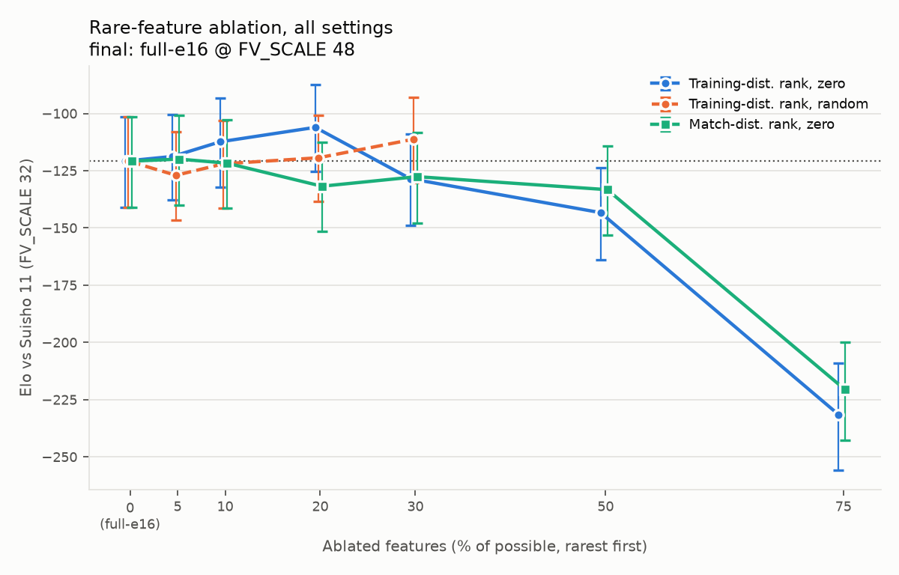
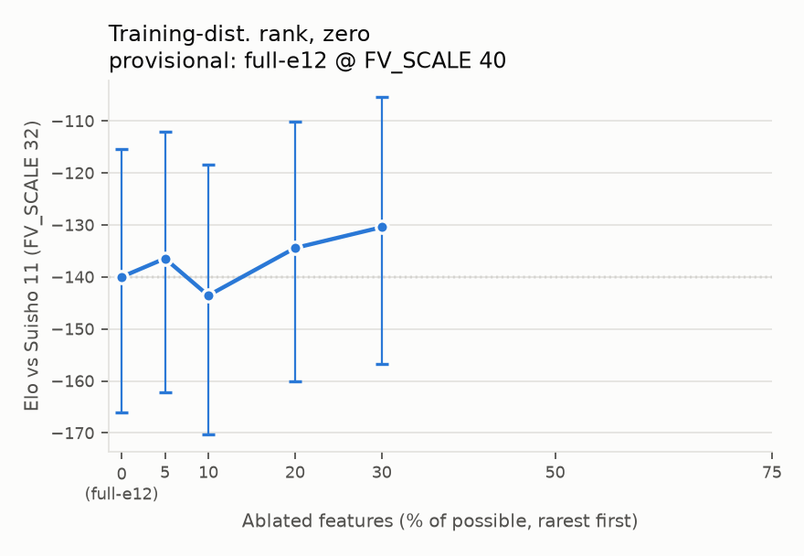
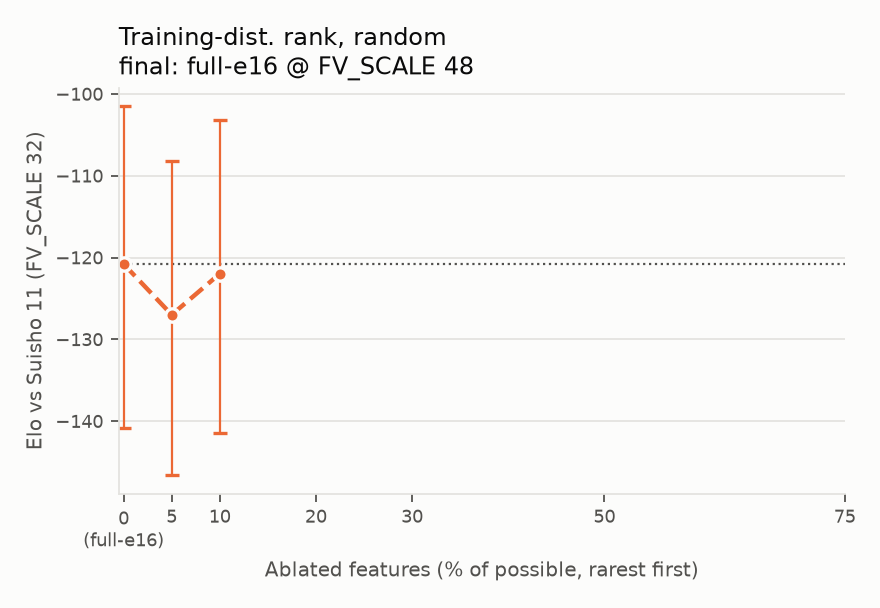
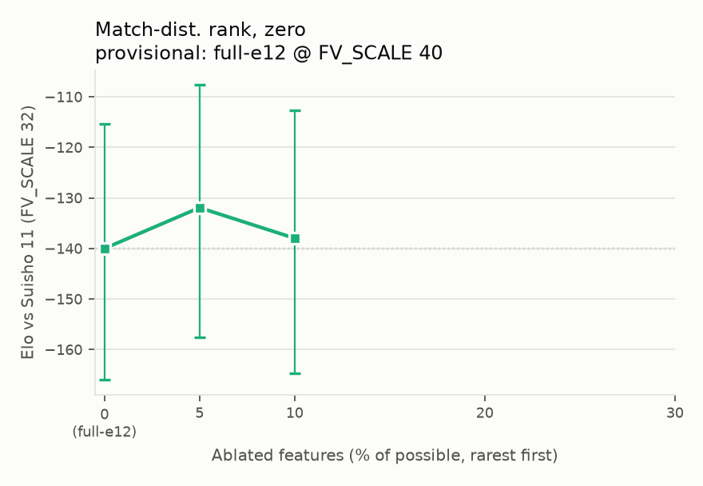
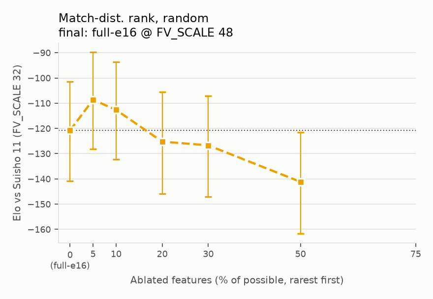
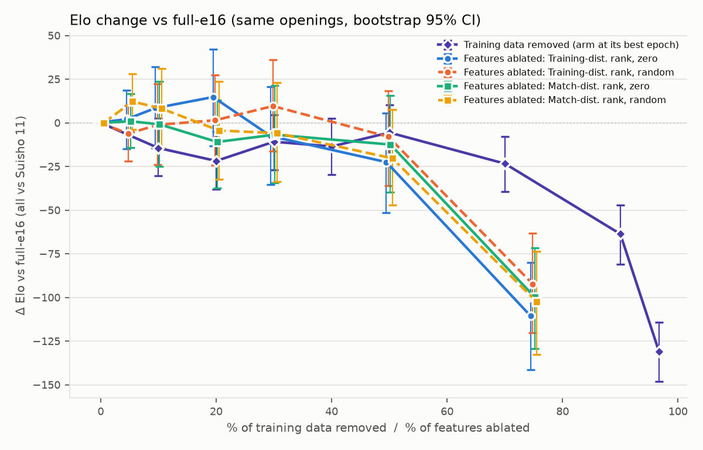

# experiment-009 の結果 (自動生成)

`plot_results.py` が対局結果から作る (手で編集しない)。すべて水匠 11 (FV_SCALE 32) との対局、300k ノード。
**基準は常に full** (最良 epoch・最良 FV_SCALE)。対局は決定的なので、アブレーションで指し手が変わらない局は
full と同じ棋譜になり、同じ開始局面どうしの差は対応のある比較になる。

## 稀な特徴量のアブレーション (final: full-e16 @ FV_SCALE 48)

| 順位 | モード | 下位 % | Elo vs 水匠 11 | 95% CI | 同じ局面での full-e16 | 局面数 | 棋譜が変わったペア |
| --- | --- | --- | --- | --- | --- | --- | --- |
| 教師 | zero | 5 | -118.8 | [-138, -100] | -120.8 | 667 | 183 |
| 教師 | zero | 10 | -112.4 | [-132, -93] | -120.8 | 667 | 332 |
| 教師 | zero | 20 | -106.1 | [-125, -88] | -120.8 | 667 | 427 |
| 教師 | zero | 30 | -128.5 | [-149, -109] | -120.8 | 667 | 404 |
| 教師 | zero | 50 | -143.3 | [-164, -124] | -120.8 | 667 | 417 |
| 教師 | zero | 75 | -231.5 | [-256, -209] | -120.8 | 667 | 412 |
| 教師 | random | 5 | -127.0 | [-147, -108] | -120.8 | 667 | 178 |
| 教師 | random | 10 | -122.0 | [-141, -103] | -120.8 | 667 | 335 |
| 教師 | random | 20 | -119.3 | [-138, -101] | -120.8 | 667 | 400 |
| 教師 | random | 30 | -111.2 | [-130, -93] | -120.8 | 667 | 414 |
| 教師 | random | 50 | -128.8 | [-148, -110] | -120.8 | 667 | 404 |
| 教師 | random | 75 | -213.1 | [-236, -192] | -120.8 | 667 | 407 |
| 対局 | zero | 5 | -119.9 | [-140, -101] | -120.8 | 667 | 163 |
| 対局 | zero | 10 | -121.7 | [-141, -103] | -120.8 | 667 | 336 |
| 対局 | zero | 20 | -131.8 | [-152, -113] | -120.8 | 667 | 386 |
| 対局 | zero | 30 | -127.6 | [-148, -108] | -120.8 | 667 | 391 |
| 対局 | zero | 50 | -133.3 | [-153, -114] | -120.8 | 667 | 403 |
| 対局 | zero | 75 | -220.6 | [-243, -200] | -120.8 | 667 | 407 |
| 対局 | random | 5 | -108.6 | [-128, -90] | -120.8 | 667 | 187 |
| 対局 | random | 10 | -112.7 | [-132, -94] | -120.8 | 667 | 323 |
| 対局 | random | 20 | -125.2 | [-146, -105] | -120.8 | 667 | 425 |
| 対局 | random | 30 | -126.7 | [-147, -107] | -120.8 | 667 | 408 |
| 対局 | random | 50 | -141.2 | [-162, -122] | -120.8 | 667 | 413 |
| 対局 | random | 75 | -223.3 | [-245, -203] | -120.8 | 667 | 403 |

## アブレーション X% ≈ データ削減 Y% (基準 full-e16)

アブレーション: ablated − full-e16、データ削減: arm (最良 epoch) − full-e16 (どれも水匠 11 に対する Elo の差)。
Y はデータ側の曲線 (単調減少に当てはめ) で同じ低下になる削減率。区間は開始局面のブートストラップ (2,000 回)。

**まとめ (4 設定の平均)**: 順位 (教師 / 対局) × モード (zero / random) の 4 本の差を平均した値。
4 本は同じ親・同じ開始局面で、選ぶ特徴量も大きく重なるので独立ではない (区間は同じ再標本で平均してから取る)。

| アブレーション X | full-e16 からの差 (Elo, 4 設定の平均) | 95% CI | 同等なデータ削減 Y | 95% 区間 |
| --- | --- | --- | --- | --- |
| 5% | +2.2 | [-9, +14] | 0% | [0%, 12%] |
| 10% | +3.6 | [-14, +23] | 0% | [0%, 19%] |
| 20% | +0.2 | [-21, +22] | 0% | [0%, 58%] |
| 30% | -2.7 | [-24, +20] | 2% | [0%, 70%] |
| 50% | -15.8 | [-38, +6] | 55% | [0%, 76%] |
| 75% | -101.3 | [-125, -78] | 94% | [92%, 96%] |

**設定ごと**:

| 順位 | モード | アブレーション X | full-e16 からの差 (Elo) | 95% CI | 同等なデータ削減 Y | 95% 区間 |
| --- | --- | --- | --- | --- | --- | --- |
| 教師 | zero | 5% | +2.0 | [-15, +19] | 0% | [0%, 53%] |
| 教師 | zero | 10% | +8.4 | [-14, +32] | 0% | [0%, 34%] |
| 教師 | zero | 20% | +14.8 | [-13, +42] | 0% | [0%, 15%] |
| 教師 | zero | 30% | -7.7 | [-35, +21] | 6% | [0%, 75%] |
| 教師 | zero | 50% | -22.5 | [-52, +6] | 68% | [0%, 83%] |
| 教師 | zero | 75% | -110.7 | [-141, -80] | 95% | [92%, >96.7%] |
| 教師 | random | 5% | -6.2 | [-22, +10] | 5% | [0%, 71%] |
| 教師 | random | 10% | -1.2 | [-24, +22] | 1% | [0%, 70%] |
| 教師 | random | 20% | +1.5 | [-24, +27] | 0% | [0%, 70%] |
| 教師 | random | 30% | +9.6 | [-16, +36] | 0% | [0%, 50%] |
| 教師 | random | 50% | -8.0 | [-36, +18] | 6% | [0%, 75%] |
| 教師 | random | 75% | -92.3 | [-120, -63] | 93% | [90%, 96%] |
| 対局 | zero | 5% | +0.9 | [-14, +17] | 0% | [0%, 55%] |
| 対局 | zero | 10% | -0.9 | [-25, +24] | 1% | [0%, 70%] |
| 対局 | zero | 20% | -11.0 | [-37, +13] | 8% | [0%, 76%] |
| 対局 | zero | 30% | -6.8 | [-34, +21] | 5% | [0%, 75%] |
| 対局 | zero | 50% | -12.5 | [-40, +16] | 9% | [0%, 77%] |
| 対局 | zero | 75% | -99.8 | [-129, -72] | 94% | [91%, 96%] |
| 対局 | random | 5% | +12.2 | [-4, +28] | 0% | [0%, 3%] |
| 対局 | random | 10% | +8.1 | [-14, +31] | 0% | [0%, 48%] |
| 対局 | random | 20% | -4.4 | [-32, +24] | 3% | [0%, 73%] |
| 対局 | random | 30% | -5.9 | [-34, +23] | 4% | [0%, 74%] |
| 対局 | random | 50% | -20.4 | [-47, +7] | 64% | [0%, 81%] |
| 対局 | random | 75% | -102.5 | [-133, -74] | 94% | [91%, >96.7%] |

| データ削減 arm | 最良 epoch | 削った割合 | full-e16 からの差 (Elo) | 95% CI |
| --- | --- | --- | --- | --- |
| p90 | e10 | 10% | -14.4 | [-30, +2] |
| p80 | e8 | 20% | -21.8 | [-38, -5] |
| p70 | e10 | 30% | -10.8 | [-27, +5] |
| p60 | e10 | 40% | -13.5 | [-30, +2] |
| p50 | e10 | 50% | -5.6 | [-20, +10] |
| p30 | e8 | 70% | -23.4 | [-40, -8] |
| p10 | e4 | 90% | -63.7 | [-81, -47] |
| p3 | e3 | 96.7% | -130.9 | [-148, -114] |

