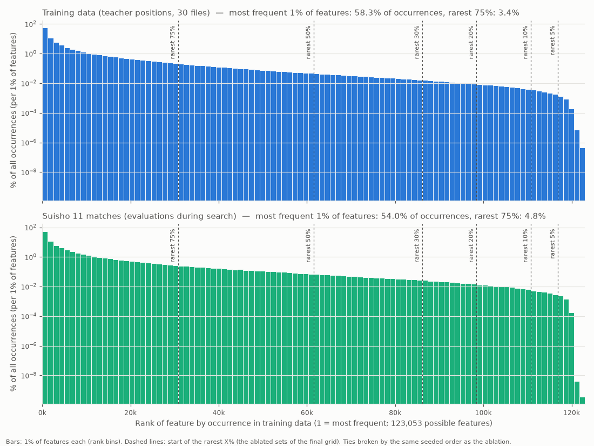
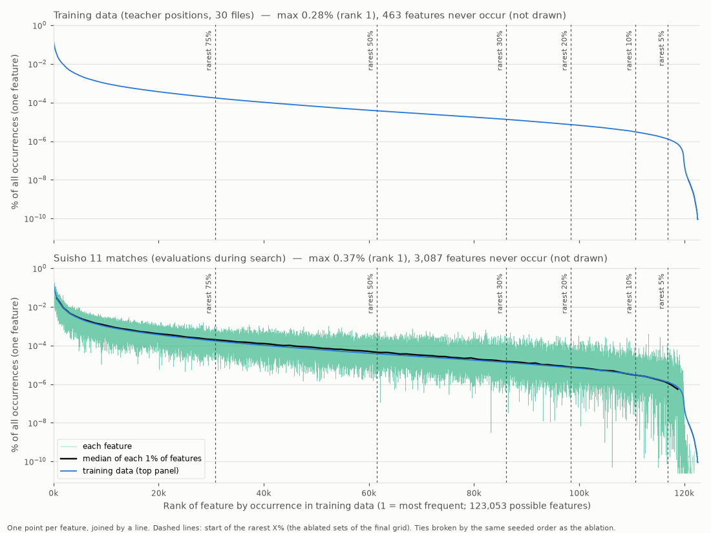

# experiment-009: 稀な FT 特徴量のアブレーション X% は、教師データを何 % 削るのに相当するか

作成: 2026-10-03 / ブランチ `exp/009-data-scaling` (PR #23) / サーバー suzuki
作業ノートは [notes/](notes/README.md)、結論の詳細は [notes/conclusion.md](notes/conclusion.md)、
自動生成の表と図は [notes/results.md](notes/results.md)、決定の記録は [notes/decisions.md](notes/decisions.md)。

## TL;DR

- 問い: **NNUE の FT の稀な one-hot 特徴量を X% アブレーションすると、教師データを Y% 削ったのと同じくらい弱くなる。
  X と Y の対応はどうなっているか** (仮説の再設定 2026-09-29。当初の「データ削減でどこまで強さを保てるか」は
  [hypothesis.md](hypothesis.md))
- 基準 full (奏乗 30 ファイル全部, 最良 e16 @ FV_SCALE 48) は水匠 11 に対して **−119.4 ± 11.3 Elo** (2,000 ペア)
- 答え (4 設定の平均, full との差):

| アブレーション X | Elo の差 | ≈ データ削減 Y |
| --- | --- | --- |
| 5〜30% | ±4 以内 (検出できない) | ≈ 0% |
| 50% | −16 [−38, +6] | ≈ 55% (区間 0〜76%) |
| 75% | **−101** [−125, −78] | **≈ 94%** (区間 92〜96%) |

- データ削減は意外に効かない: 削減 10〜50% で −6 〜 −22 Elo、70% で −23、90% で −64、96.7% で −131
- 下位 75% の特徴量は探索中の発火の 4〜5% しか占めないのに、その学習済みの重みを失うことは教師局面の
  約 94% を失うのと同じくらい効く

## 用語

- **FT** (feature transformer): HalfKA2 の 131,949 特徴量 (自玉のマス 81 × 駒入力 1,629) → 1,024。
  ネット全体 約 1.352 億パラメータのうち FT が約 99.9% (layer stack 9 組は計 約 9 万)
- **`w_specific` / `w_factor`**: BulletOu の FT factorizer。nn.bin の行 (K, P) = `w_specific[K,P]` + `w_factor[P]`
  ([notes/bulletou-internals.md](notes/bulletou-internals.md))。`w_factor` は玉位置によらないのでほぼ稀にならない
- **下位 X%**: 構造的に現れ得る 123,053 個の特徴量を出現回数の少ない順に並べた先頭 X% (タイはシード 0 の乱数順)
- **順位 2 種**: 教師順位 = 教師データ 30 ファイルでの出現回数、対局順位 = 水匠 11 同士の対局 (2,000 ペア, 300k ノード)
  の探索中の評価での発火回数 (計測版やねうら王, [notes/feature-counts.md](notes/feature-counts.md))
- **モード 2 種**: zero = `w_specific` を 0 (= 厳密に「未学習」)、random = 同じ大きさ (学習後の RMS) の正規乱数
- **arm pNN**: 教師を NN% だけ残して同じレシピで学習したネット (p3 = 1 ファイル = 3.3%)
- **BulletOu-epoch**: 108 superbatch × 40M = 43.2 億局面の LR サイクル (データ量とは無関係, experiment-005 の定義)

## 方法

### 学習 (全ネット共通)

| 項目 | 値 |
| --- | --- |
| トレーナ | BulletOu `2a8e5ed` (cuda-cpp, multiarch patch) |
| アーキテクチャ | `SFNN_halfka2_1024_7_64_k3k3` |
| 教師 | 奏乗 (dlsuisho_unique 001〜030, 計 約 146.7 億局面)。arm は 1 の位で交互に取ったサブスタックのネスト (`subsets.py`) |
| loss | sigmoid-MSE (WRM なし, lambda 1.0, scale 290) |
| optimizer | Ranger, weight decay 0 |
| LR | 0.000875 → 0.000030, step。1 BulletOu-epoch ごとに warm restart (各 epoch 末の checkpoint = LR 最小点) |
| batch / superbatch | 65,536 / 40M 局面 (実効 39,976,960), 108 superbatch = 1 epoch |
| epoch 数 | full 20、arm 10 (p3 のみ 4) |
| 検証 | floodgate.hcpe 300k 局面 (4 superbatch ごと, test-seed 20260928) |

### アブレーション

- 対象は full-e16 (full の最良)。4 設定 (教師順位 / 対局順位 × zero / random) × 下位 5, 10, 20, 30, 50, 75% の 24 ネット
- `ablate/ablate.py` が checkpoint の `state.bin` から `w_specific` の行を書き換え、畳み込み・量子化して nn.bin を書く
  (検証は [notes/ablation.md](notes/ablation.md))。`w_factor` は常に残す

### 対局 (レーティング)

| 項目 | 値 |
| --- | --- |
| 相手 | 水匠 11 (FV_SCALE 32 = 自己対局で FV_SCALE 16 に対して最良) |
| 探索部 | やねうら王 V9.60 (`9133c527`) + experiment-008 の `finny.patch`, AVX2 ビルド |
| 探索量 | **1 手 300,000 ノード固定** (`go nodes`, 1 スレッド ≈ 0.36 秒相当)。持ち時間なし |
| スレッド / Hash | 各エンジン Threads 1 (完全に決定的), USI_Hash 256 MB。毎局 `isready` で置換表を空にする |
| その他の USI 設定 | Ponder なし, MultiPV 1, NetworkDelay 0, 定跡なし, MaxMovesToDraw 0 |
| 開始局面 | やねうら王互角局面集 2025 の 24 手目局面集 (30,053 局面, MIT) から等間隔ストライドで抽出 |
| ペア数 | 先後入れ替えの 2 局 = 1 ペア。full と arm は 2,000、アブレーションは 667、arm の epoch 選択は 300 (どれも 2,000 の部分集合) |
| 終局 | 詰み・投了・入玉宣言、同一局面 4 回で千日手 (連続王手は負け)、320 手で引き分け |
| 学習ネットの FV_SCALE | 48 (full の最良値) をすべてのネットで使う |
| 並列 | ワーカーごとにエンジン 2 本 (候補と水匠 11) で、最大 62 ワーカー (物理 64 コア) |

- full の最良は epoch {5, 8, 12, 16, 20} × FV_SCALE 32〜64 の格子 (21 点, 各 400 ペア) の Elo 最大で決めた
  (e16 @ 48, −112.3。2,000 ペアで測り直して −119.4)
- arm は候補 epoch (p10: e1/2/3/4/6、p3: e1〜4、他: e2/4/6/8/10) を 300 ペアずつ対局して最良を選び、2,000 ペアで測る

### 解析

- 差はすべて「同じ開始局面での full-e16 との Elo 差」(開始局面ごとの対応のある比較)。区間は開始局面のブートストラップ (2,000 回)
- データ側の曲線 (削減率 → Elo の差) を単調減少に当てはめ (PAV)、アブレーションの差と同じ値になる削減率を Y とする

## 結果

### データ削減 (各 arm の最良 epoch)

| 削った割合 | arm (最良 epoch) | Elo vs 水匠 11 | full-e16 との差 | 95% CI |
| --- | --- | --- | --- | --- |
| 0% | full (e16) | −119.4 | 0 | |
| 10% | p90 (e10) | −133.9 | −14.4 | [−30, +2] |
| 20% | p80 (e8) | −141.2 | −21.8 | [−38, −5] |
| 30% | p70 (e10) | −130.3 | −10.8 | [−27, +5] |
| 40% | p60 (e10) | −132.9 | −13.5 | [−30, +2] |
| 50% | p50 (e10) | −125.0 | −5.6 | [−20, +10] |
| 70% | p30 (e8) | −142.8 | −23.4 | [−40, −8] |
| 90% | p10 (e4) | −183.1 | −63.7 | [−81, −47] |
| 96.7% | p3 (e3) | −250.3 | −130.9 | [−148, −114] |

### アブレーション → 同等なデータ削減 Y (4 設定の平均)

| アブレーション X | 探索の発火に占める割合 | Elo の差 | 95% CI | Y | Y の 95% 区間 |
| --- | --- | --- | --- | --- | --- |
| 5% | 0.001〜0.004% | +2.2 | [−9, +14] | 0% | [0%, 12%] |
| 10% | 0.01〜0.03% | +3.6 | [−14, +23] | 0% | [0%, 19%] |
| 20% | 0.07〜0.13% | +0.2 | [−21, +22] | 0% | [0%, 58%] |
| 30% | 0.2〜0.3% | −2.7 | [−24, +20] | 2% | [0%, 70%] |
| 50% | 0.9〜1.2% | −15.8 | [−38, +6] | 55% | [0%, 76%] |
| 75% | 4.2〜4.8% | −101.3 | [−125, −78] | 94% | [92%, 96%] |

- 設定ごとの 24 行と各設定の図 (5 枚) は [notes/results.md](notes/results.md)。zero と random、教師順位と対局順位の差は
  どの X でも誤差の範囲。下位 75% は 4 設定それぞれで Y = 93〜95%
- loss (教師の一様標本での差) は X とともに単調に増え、Elo が動かない 30% でも検出できる (+0.0004〜+0.0007)。
  75% で +0.009〜+0.013 (full-e16 の loss 0.0329 の 26〜39%) ([notes/ablation.md](notes/ablation.md))

### 特徴量の出現の偏り

横軸はどちらも教師データでの出現順位 (1 = 最多)。点線は最終アブレーションの「下位 X%」の境界。

- 上位 1% の特徴量 (約 1,231 個) だけで出現の過半を占める (教師 58.3%、水匠 11 の対局 54.0%)。上位 10% で約 90%
- 下位 75% は教師 3.4%、対局 4.8%

1 特徴量 = 1 点の版 (対局だけ / 教師だけの版は `figures/feature_rank_line_match.png`, `figures/feature_rank_line_teacher.png`):

- 最多の特徴量でも出現の 0.28% (教師) / 0.37% (対局)。教師で稀な特徴量は対局でも稀で、1% 区間ごとの中央値は教師の曲線と
  ほぼ重なる (分布の距離 TV 0.20, JS 0.05 bit)。現れ得るのに一度も出現しない特徴量は教師 463 個、対局 3,087 個

## 解釈

1. 下位 30% までのアブレーションは「データを削らない」のと区別できない。これらは探索の発火の 0.3% 以下
2. 下位 50% のアブレーション (−16 Elo) は、データを約半分削るのと同程度。ただしデータ側の曲線が削減 10〜50% で
   ほぼ平ら (約 −13 Elo) なので Y の区間は広い。言えるのは「データを 70% 削る (−23 Elo) ほどは弱くならない」まで
3. 下位 75% のアブレーション (−101 Elo) ≈ データの約 94% の削減。データを 90% 削っても −64 Elo にとどまる。
   データを削っても稀な特徴量の行は (少ない局面からではあるが) 学習されるのに対し、アブレーションはその行の学習結果を
   すべて捨てる、という違いと整合する
4. 教師データは削っても強さが落ちにくい (半分で −6、7 割削って −23)。experiment-009 の当初の仮説
   (「教師は過剰で、削っても水匠 11 級に届く」) の方向と整合するが、測ったのは full の最良 (水匠 11 比 −119) との差である

## 限界 (妥当性への脅威)

1. **学習量の差**: arm は最大 10 epoch、full は 20 epoch 中の最良 (e16)。full 自身も e8 ≈ −133、e12 ≈ −120 Elo
   (FV_SCALE 格子, 各 400 ペア) なので、データ削減の差の一部 (数〜10 Elo 程度) は学習量の差の可能性がある (時間の制約)
2. **optimizer**: Ranger (Adam 系) は重みごとに更新幅を正規化するので、稀な特徴量の不利を一部打ち消す。
   SGD で学習したモデルでは稀さの影響が大きく出る可能性がある
3. **データ削減が測るもの**: 同一レシピ (同一ステップ数) でデータを減らしても、稀な行の更新回数はほぼ変わらない
   (同じ局面を多く周回するだけ)。データ削減 arm が測るのは「更新回数」ではなく「異なる局面の多様性」
4. **ばらつき**: データ側は削減 10〜50% で順序が入れ替わる (p90 −14, p80 −22, p50 −6)。学習 1 本ごとの揺らぎと
   対局の誤差が ±10 Elo 程度あり、単調減少の当てはめでならしている。arm は各 1 本 (複製なし)
5. **最良 epoch の選択**: 300 ペアで選んだ epoch を 2,000 ペアで測り直した。選択に使った 300 ペアの開始局面は
   2,000 ペアに含まれるので、わずかに上振れし得る
6. **4 設定の平均**は、同じ親・同じ開始局面・大きく重なる特徴量集合なので、独立な 4 回の平均ではない
7. **FV_SCALE** はすべて full の最良値 (48) に固定 (arm・アブレーションごとには合わせていない)
8. **p3 は後から追加**: p10 の低下が下位 75% のアブレーションに届かないと分かってから追加した (事後の決定)。
   E=4 (1 epoch ≈ p3 の 8.8 周) で、e3 が最良 (e1 −283, e2 −262, e3 −235, e4 −266; 各 300 ペア)。頭打ちしてから
   測っているので学習不足ではないと見る
9. **対局条件は 1 つだけ**: 相手は水匠 11、1 手 300k ノード固定のみ。探索量や相手を変えると結果は変わり得る
10. **アブレーションは 667 ペア**: arm (2,000 ペア) より区間が広い (各 ±15〜30 Elo)
11. **探索のカオス性**: 下位 5% のアブレーションでも 1,334 局中 約 90% で棋譜が親と変わる (分岐は中央値で 86 手目)。
    下位 10% で 98% (59 手目)、20% 以上ではほぼ全局が開始直後 (27〜39 手目) に分かれる
    ([notes/ablation.md](notes/ablation.md))。ペアの得点が変わるのは 667 ペア中 約 170〜430 ペアで、対応のある比較による
    誤差の減り方は想定より小さい
12. ネット・アーキテクチャ・トレーナは 1 種類 (SFNN_halfka2_1024_7_64_k3k3, BulletOu)

## 再現

- 学習: `experiments/009-data-scaling/train_supervised.py --arm <arm> --gpu <n> --epochs <E>`
  (`run_training.sh` を呼ぶ。W&B は環境変数の API キーが無ければ offline)
- 全工程の自動化: `pipeline.py` (状態 `/mnt/nvme1/sugiyama/pipeline/state.json`)、対局キュー `match_queue.py` +
  `match_queue.toml`、対局 `match_nodes.py`、結果の表と図 `plot_results.py`
- アブレーション: `ablate/select_features.py` → `ablate/ablate.py`。出現回数: `feature_count/` (教師), `search_featcount/` (対局)。
  図: `feature_count/plot_rank_hist.py`
- 対局の全棋譜 (games.jsonl) と集計 (summary.json) は `games/<job>/`、一覧は [notes/ratings.md](notes/ratings.md)
- 電力の制約 (ブレーカー): GPU と CPU を同時に使うときは GPU 3 枚 + 32 コアまで ([notes/server-suzuki.md](notes/server-suzuki.md))

## 付録: バイナリとネットの sha256

| ファイル | sha256 |
| --- | --- |
| やねうら王 (AVX2, finny) `~/engines/009-finny-avx2/YaneuraOu-by-gcc` | `423b6b1cd3477321d0a049632d7966301981d158ef381e0fa14f04012995b94e` |
| 水匠 11 `~/suisho11/nn.bin` | `a78b7f889843037d344f482623b3febd124ead5c1f34f134d9f1c2c78cd0f829` |
| 互角局面集 `data/books/start_sfens_ply24.txt` (LF 正規化後) | `a11e3ae7efd34f4c7ad8a7e42c0f610239927970259a57915f06a644cee8d90d` |
| full-e16 `009-full/0016/nn.bin` | `b68d6d7b320de52675a4e08163022999a883d5c02823b988d406f278e36c8239` |
| p90-e10 `009-p90/0010/nn.bin` | `82a55e87cde549e46ceca495a4aab40131cf76c419acf0cbabec3b038bc179b2` |
| p80-e8 `009-p80/0008/nn.bin` | `0ede7657c7a948ac9ccfc4d1c1d1a28fa9e30be025bf778e1648d520e2aca59b` |
| p70-e10 `009-p70/0010/nn.bin` | `2ba4323af2a9dc5ba6064e9ddb4890702ac38b3bdbdc3a6826addf91dd3802dc` |
| p60-e10 `009-p60/0010/nn.bin` | `091cafc90f9d78d82c689c0633e74997a2bba88350bf79add7630b6552b15b4d` |
| p50-e10 `009-p50/0010/nn.bin` | `3c3c4e29e823504088a0870e561fbcc23e6dfbed170864e1175e6301452486eb` |
| p30-e8 `009-p30/0008/nn.bin` | `d0bccedbae40bc6126d5aae48f0b0986e98fb8efd15e51ae0797a004affd2c5b` |
| p10-e4 `009-p10/0004/nn.bin` | `68f848016eb62c472816ea66693ace6dbf6d5cac2e0394bbdc7808f820bd95eb` |
| p3-e3 `009-p3/0003/nn.bin` | `d036c6259dc936a4b23dd0ade3926b6531d51a4d1c3e1dd5a4e251c4bc0fd088` |

checkpoint は `/mnt/nvme1/sugiyama/checkpoints/` (= `data/bulletou/checkpoints/`)。アブレーションの 24 ネット
(`/mnt/nvme1/sugiyama/ablated/full-e16-<zs|rs>-<teach|match>-f<X>/nn.bin`):

| ネット | sha256 |
| --- | --- |
| zs-teach-f5 | `ada4ffa411e1c75be4ccfdc473e038f7e9422d59ce9b5d8938d382b222527b2d` |
| zs-teach-f10 | `0eecb9a8b4ccba80e18f02b4d5ba9969db12c4fcc5aeb0d2904167a29a449a55` |
| zs-teach-f20 | `10e3e2b17358cc9089f542f48f06d84d482ca3dca8adbef677d799aeadd3468c` |
| zs-teach-f30 | `4d27ed29b56ff8f7fe36949eef30ef090832882b1a793287a19ee2a25b184c46` |
| zs-teach-f50 | `be43d16af6fa9268fc09080029a6d53453c1a0b1d785fa38018d0e48406bd1d8` |
| zs-teach-f75 | `f7ed016489e6e1932d55e941f8ca0bf08a8929dc564aaed6c78a88b17bad463c` |
| rs-teach-f5 | `71afcfbd319b32b83fd13c561836ff3377dd87fa42ecb77b90f5316c08ffac92` |
| rs-teach-f10 | `53d51bb8ba7b8c6d0274c203f4833e715d4d8d74b543a27bbb5d831efd1e5eb3` |
| rs-teach-f20 | `13e8c4486a5545d43365405f8f17f03283af03bed4b1c81251ea31bddecea0d3` |
| rs-teach-f30 | `7d2177fb8741c429ca549696c66fc555a429056b8acb43a954fa1f8f2aa9d7bf` |
| rs-teach-f50 | `c6862c9bc96a56cfa78e9dfc90fa9c960ecdd1488c2fbe972b32dd252c9c726e` |
| rs-teach-f75 | `e32530c9c39e75fcba43e8a399c322abbcac803192177eeeb9ef1d1ef3dd70ef` |
| zs-match-f5 | `777d19c2062eb4a0dc406a507290873d0f7f61944d2794b9e594c6c5a3e2df79` |
| zs-match-f10 | `8b99b176e89c77d22a258bb8b0b25c92e0929e50f6e2e0f40f9de4bbd96f714e` |
| zs-match-f20 | `b5be4269e0e99ac69b582113697e0de7b93a1c2110484b9485b2d22e5da398f2` |
| zs-match-f30 | `f53462179ba28a55487b5ee8e147371dd27e91410c1fc53e2d2c90f899d8686f` |
| zs-match-f50 | `987b6c40010e12875f9890e5deeaeeb9db56e7bb4244f8f1ea3c5146b0ab1fe6` |
| zs-match-f75 | `ebc51784d7b04815af3c5d61f419f41b141e8fa398300a8ba7885fed1b83083e` |
| rs-match-f5 | `960b21baa520d907535b672058f9480ea85c69a447c5c8f08152f9278558e83d` |
| rs-match-f10 | `2e76fa6b0ef7c0aebf17445710d8c734886ff4c702d1be20985609ca8a9b7e65` |
| rs-match-f20 | `f30bd9400ada09852008f8adb332a2ab992ac4df0b7007ab1003f88a916f9a77` |
| rs-match-f30 | `9e18a3aa4920caea7fdf271da6267d441ea96b036648866abf07f625440dd130` |
| rs-match-f50 | `d929e2f08d2ad1877076765cad824463d22d3b1f66d0a0cbbe2d025d5d10bcfd` |
| rs-match-f75 | `ba80e94a703a031d2ab73ee5992b0007a177f273b41a34a7617ae92747d8026a` |
